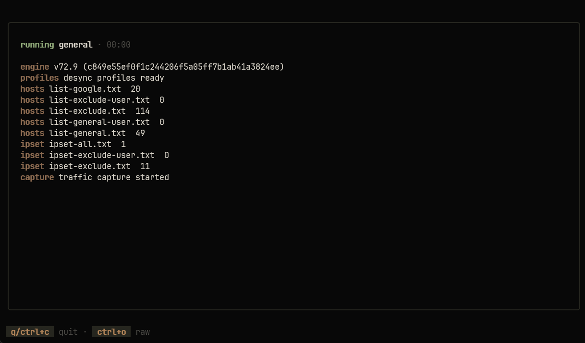

# sieve

[](https://github.com/elev1e1nSure/sieve/releases/latest)
[](https://github.com/elev1e1nSure/sieve/actions/workflows/ci.yml)

**Просеивает конфиги, пока что-то не сработает.**

DPI не идёт на компромиссы — значит, и sieve не идёт. Портативный Windows TUI,
который тянет ассеты Flowseal zapret, прогоняет по очереди все вшитые
конфиги `winws` для Discord и YouTube, оставляет работающий и запоминает его
до следующего запуска.

<picture>
  <source media="(prefers-color-scheme: dark)" srcset="assets/screenshot.png">
  
</picture>

## Установка

Требования: Windows, права администратора во время работы.

```powershell
scoop bucket add elev1e1nSure https://github.com/elev1e1nSure/scoop-bucket
scoop install sieve
```

Либо взять `sieve-windows-amd64.exe` напрямую из
[релизов](https://github.com/elev1e1nSure/sieve/releases/latest).

Сборка из исходников требует Go 1.26+ и [`just`](https://github.com/casey/just).

## Использование

Собрать и запустить:

```powershell
just build
.\sieve.exe
```

Запустить из исходников:

```powershell
just run
```

Указать свой таймаут проверки соединения:

```powershell
just run-timeout 10
.\sieve.exe --test-timeout 10
```

При запуске без флагов sieve открывает стартовое меню. Стрелками можно выбрать
просеивание или настройки, `Enter` подтверждает выбор. Для запуска подбора и
активации обхода напрямую без меню используется подкоманда `run`:

```powershell
.\sieve.exe run
```

В настройках доступны все сохраняемые параметры и обслуживающие действия:
обновление sieve и IPSet, остановка активного экземпляра, диагностика, сброс
результатов и очистка кэша Discord. После сохранения sieve возвращается в
главное меню.

Флаги обходят стартовое меню: параметры сохраняются или выполняется выбранное
обслуживающее действие, после чего программа завершается. Одновременно может
работать только один экземпляр sieve.

**Управление:** `↑`/`↓`, `Enter`, `Esc` и `q`. Во время просеивания выход —
`q` или `Ctrl+C`. sieve завершает дерево `winws.exe`, дожидается удаления
службы WinDivert и сообщает об ошибке, если очистка не завершилась. Процессы
связаны Windows Job Object, поэтому `winws.exe` также завершается при
аварийном закрытии sieve.

**Команды для разработки:**

| Команда | Назначение |
|---|---|
| `just` | Список всех команд |
| `just build` | Локальная сборка |
| `just release-build` | Релизная сборка |
| `just run` | Запуск из исходников |
| `just test` | Тесты |
| `just fmt` | Форматирование |
| `just lint` | Проверка линтером |
| `just check` | fmt + lint + test + build |
| `just clean` | Очистка результатов сборки |

## Конфигурация

Флаги сохраняются в `settings.json` и применяются при следующих запусках.

Сбросить кэш результатов конфигов перед запуском:

```powershell
.\sieve.exe --reset-cache
```

Отключить кэш конфигов для текущего запуска:

```powershell
.\sieve.exe --no-cache
```

Настроить списки Flowseal перед запуском:

```powershell
.\sieve.exe --update-ipset --ipset loaded
.\sieve.exe --ipset none
.\sieve.exe --ipset any
.\sieve.exe --domain discord.media --domain-file .\domains.txt
```

Включить фильтры игрового трафика:

```powershell
.\sieve.exe --game all
.\sieve.exe --game tcp
.\sieve.exe --game udp
```

Показать метаданные сборки:

```powershell
.\sieve.exe --version
```

## Обслуживание

Запустить диагностику системы:

```powershell
.\sieve.exe --diagnostics
.\sieve.exe --diagnostics --fix
```

Очистить кэш Discord:

```powershell
.\sieve.exe --clear-discord-cache
```

Обновить sieve до последнего релиза на GitHub:

```powershell
.\sieve.exe --update
```

Для приватных релизов задайте `GH_TOKEN` или `GITHUB_TOKEN` перед запуском.
При обычном запуске без флагов sieve тихо заменяет себя и перезапускается.
Замена выполняется скрытым helper-процессом с проверкой установленного файла.

Принудительно завершить активный экземпляр sieve, его `winws.exe` и удалить
оставшуюся службу WinDivert:

```powershell
.\sieve.exe --stop
```

`--stop` сначала просит активный TUI аккуратно завершить cleanup и только при
зависании принудительно завершает его дерево процессов. Команда не завершает
сторонние экземпляры `winws.exe` — старые процессы sieve определяются по
точному пути `%APPDATA%\sieve\bin\winws.exe`.

## Архитектура

sieve — Windows TUI на Bubble Tea и Lip Gloss. Скачивает ассеты
[zapret-discord-youtube](https://github.com/Flowseal/zapret-discord-youtube),
прогоняет вшитые конфиги `winws`, проверяет доступность Discord и YouTube
через HTTP, оставляет первый работающий конфиг. Результаты кэшируются в
`%APPDATA%\sieve\cache.json`, настройки — в `%APPDATA%\sieve\settings.json`.

Детальное описание архитектуры — в [CLAUDE.md](CLAUDE.md).

## Лицензия

Не указана.
